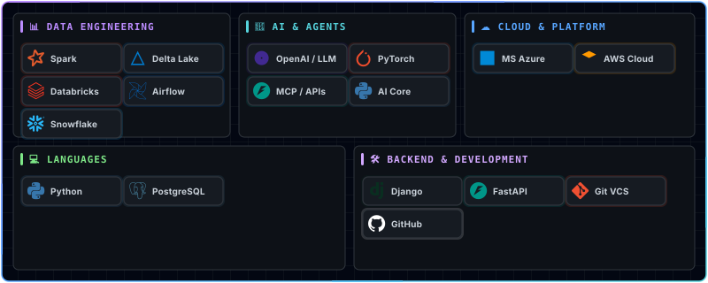

  
  <!-- Hero Banner -->
  

    

  <!-- Position Badges (Inline on a single line to guarantee horizontal rendering) -->
  &nbsp;&nbsp;&nbsp;&nbsp;

    

  ### 🚀 Senior Data Engineer | AI Builder | Open Source Explorer | Tech Creator

  **Building scalable data platforms, exploring AI agents, and sharing useful AI & developer tools.**

 

  

<!-- Animated Sci-Fi hologram bio panel -->

<!-- Hidden text for search indexing/SEO -->
<!--
ABOUT ME:
Shobhit Rawal is a Senior Data Platform Architect with 9+ years of professional experience designing and constructing high-throughput, resilient data architectures. He is an AI Builder & Researcher specializing in AI Agents, Model Context Protocol (MCP) Servers, and RAG architectures to automate workflows. He is an Open Source Explorer committed to developing tools, exploring codebases, and sharing robust developer resources. Tech Content Creator sharing guides, video walkthroughs, and developer tips under the brand its_shobhit.ai.
-->

  

 

  

<!-- Fully Animated pulsing neon Tech Stack dashboard -->

<!-- Hidden text for search indexing/SEO -->
<!--
TECH STACK:
- Data Engineering: Apache Spark, PySpark, Databricks, Delta Lake, Apache Airflow, Snowflake.
- AI Engineering: LLMs, OpenAI, PyTorch, RAG Systems, AI Agents, Claude Code, MCP Servers.
- Cloud Platform: Microsoft Azure, AWS, Azure Data Factory.
- Languages: Python, SQL/PostgreSQL.
- Development: Django, FastAPI, Git, GitHub.
-->

  

 

  

Here are some of the key open-source projects, tools, and portfolios I have built:

> [!IMPORTANT]
> ### 📓 [Senior Data Engineer Interview Playbook](https://github.com/shobhitrawal-skr/senior-data-engineer-interview-playbook)
> **A complete playbook with SQL, PySpark, Spark internals, Databricks, Azure architectures, System Design, coding questions, and real-world interview scenarios.**
>
> 🛠️ **Technologies:** `PySpark` • `Apache Spark` • `SQL` • `Databricks` • `Delta Lake` • `Azure`

> [!NOTE]
> ### 🎬 [Stitchr Release](https://github.com/shobhitrawal-skr/stitchr-release)
> **Desktop application assets and packages for Stitchr — a tool providing a quick, easy, and powerful video stitching experience.**
>
> 🛠️ **Technologies:** `Video Stitching` • `Desktop Application` • `Product Packaging`

> [!TIP]
> ### 🕸️ [VidNestor Web](https://github.com/shobhitrawal-skr/vidnestor-web)
> **Web client dashboard and interface for the VidNestor ecosystem, enabling nested video layout and video library organization.**
>
> 🛠️ **Technologies:** `JavaScript` • `HTML5` • `CSS3` • `Web Client`

> [!WARNING]
> ### 🧠 [Second Brain Guide](https://github.com/shobhitrawal-skr/second-brain-guide)
> **Personal knowledge management guide and resources based on the Second Brain methodology to optimize developer productivity and research.**
>
> 🛠️ **Technologies:** `Markdown` • `HTML` • `Productivity Workflows`

> [!NOTE]
> ### 📦 [VidNestor Release](https://github.com/shobhitrawal-skr/vidnestor-release)
> **Deployment packages and release assets for the VidNestor nested video manager application.**
>
> 🛠️ **Technologies:** `Release Management` • `Application Packaging` • `Deployment`

 

 

  

> [!TIP]
> *   ❖ **Agentic AI Frameworks**: Designing custom orchestrators for multi-agent execution loops.
> *   ❖ **Claude Code & MCP**: Implementing custom Model Context Protocol servers to hook local APIs and tools directly to LLM agents.
> *   ❖ **Vector DBs & RAG**: Optimizing hybrid search, chunking strategies, and semantic routing architectures.
> *   ❖ **Open Source AI Tools**: Testing local small language models (SLMs) and automated agentic coding assistants.

 

 

  

<!-- Contribution Line Graph from Screenshot 2 -->

  

 

  <table border="0">
    <tr>
      <td width="50%" align="center">
        
      </td>
      <td width="50%" align="center">
        
      </td>
    </tr>
    <tr>
      <td colspan="2" align="center">
         
        
      </td>
    </tr>
  </table>

 

 

  

#### Latest from [@its_shobhit.ai](https://www.instagram.com/its_shobhit.ai)
<!-- START_SECTION:content -->
*   🎥 **Building MCP Servers from scratch** — Connecting Claude Code to local database APIs.
*   ⚡ **Spark Optimization Techniques** — Broadcast joins vs. shuffle hash joins in PySpark.
*   🤖 **Deploying Local AI Agents** — Running agentic workflows locally with Ollama and crewAI.
*   📦 **Organizing Personal Knowledge** — Setting up a Developer Second Brain in markdown.

*Note: These posts are manually curated. You can edit this section directly to highlight your latest content.*
<!-- END_SECTION:content -->

 

 

  

<!-- START_SECTION:activity -->
*   🌱 Created branch `main` in [shobhitrawal-skr/my-profile](https://github.com/shobhitrawal-skr/my-profile)
*   🌱 Created branch `main` in [shobhitrawal-skr/shobhitrawal-skr](https://github.com/shobhitrawal-skr/shobhitrawal-skr)
<!-- END_SECTION:activity -->

 

 

  

<!-- START_SECTION:repositories -->
*   **[senior-data-engineer-interview-playbook](https://github.com/shobhitrawal-skr/senior-data-engineer-interview-playbook)** • ` HTML ` — A complete Senior Data Engineer Interview Playbook with SQL, PySpark, Spark, Databricks, Azure, System Design, coding questions, and real-world interview scenarios
*   **[second-brain-guide](https://github.com/shobhitrawal-skr/second-brain-guide)** • ` HTML ` — Build your own AI-powered Second Brain with Obsidian and AI coding agents — complete setup guide, prompts, knowledge graph, automation, and workflows. 🧠🤖
*   **[vidnestor-web](https://github.com/shobhitrawal-skr/vidnestor-web)** • ` JavaScript ` — Web interface for VidNestor — a simple and user-friendly tool for downloading videos and audio with multiple format and quality options. 🎥⚡
*   **[stitchr-release](https://github.com/shobhitrawal-skr/stitchr-release)** — Stitchr providing an easy and powerful video stitching experience
<!-- END_SECTION:repositories -->

 

 

  

  
  
  

***

#### ℹ️ How to Customize this Portfolio
*   **Static sections**: Directly edit this `README.md` file to update your bio, tech stack, featured projects, or currently exploring items.
*   **Latest Content**: The section marked with `<!-- START_SECTION:content -->` holds your manual content highlights. Simply edit the bullet points in this block to refresh links. An RSS feed aggregator script can be wired to update this block automatically in the future.
*   **Automated sections**: The sections labeled with `repositories` and `activity` are dynamically managed and updated daily by the GitHub Actions workflow using your latest public GitHub data.
